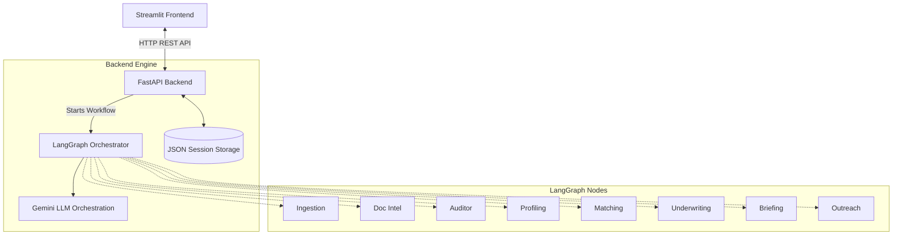

# Banking Suite - Enterprise Security Portal 🏦

An intelligent, multi-agent banking dashboard designed for Relationship Managers (RMs) to instantly process, analyze, and engage with massive batches of customer leads. Powered by LangGraph and Google's Gemini, this system automatically validates documents, determines loan eligibility, builds customer profiles, and drafts hyper-personalized outreach messages via WhatsApp, Email, or SMS.

---

## 🏗️ Core Architecture & Working Principle

The Banking Suite is divided into a **Streamlit Frontend** (for the UI) and a **FastAPI + LangGraph Backend** (for the AI engine). 

**Working Principle:**
1. RMs upload raw text, CSVs, or spreadsheets containing hundreds of leads.
2. The FastAPI backend receives the data and spawns an asynchronous LangGraph workflow.
3. A fleet of specialized AI Agents analyzes each lead in parallel:
   - **Ingestion**: Cleans and normalizes raw text.
   - **Document Intelligence (DocIntel)**: Scans for missing required documents.
   - **Auditing**: Flags discrepancies (e.g., mismatched income vs EMI).
   - **Profiling**: Scores the lead's buying intent and risk level out of 100.
   - **Matching**: Recommends primary and cross-sell banking products.
   - **Underwriting**: Calculates eligible loan amounts, FOIR, and LTV.
   - **Briefing**: Generates a 20-second executive summary for the RM.
   - **Outreach**: Drafts a personalized communication (Email, WhatsApp, SMS) based on tone.
4. The processed leads are saved to a dedicated JSON session store.
5. The Streamlit frontend fetches and displays the enriched leads in a sleek, dynamic dashboard.

### System Architecture Diagram



### Agentic Workflow Diagram (LangGraph)


---

## 🔌 API Routes Documentation

The FastAPI backend exposes several REST endpoints for the frontend to interact with the system. Here is a breakdown of what each route does and what inputs are required to test it:

### 1. `POST /api/v1/leads/upload`
- **Purpose**: Uploads raw lead data (TXT, PDF, CSV, Excel, Numbers), parses the content, runs it through the AI workflow (or bulk import logic), and saves the processed leads to the RM's session.
- **Required Inputs**:
  - `rm_owner` (Query Parameter): The username of the RM (e.g., `selvan`).
  - `file` (Form Data): The file to upload.

### 2. `GET /api/v1/leads/active-leads`
- **Purpose**: Retrieves all active, processed leads belonging to a specific RM session from the JSON storage.
- **Required Inputs**:
  - `rm_owner` (Query Parameter): The username of the RM.

### 3. `POST /api/v1/leads/update-info`
- **Purpose**: Manually updates specific fields of an existing lead (e.g., when an RM corrects a parsed value in the UI) and saves it back to storage.
- **Required Inputs (JSON Body)**:
  - `rm_owner` (String): The username of the RM.
  - `lead_id` (String): The unique UUID of the lead.
  - *(Optional)* Any other fields to update (e.g., `customer_name`, `income_mentioned`, etc.).

### 4. `POST /api/v1/leads/recalculate`
- **Purpose**: Re-runs specific agent nodes (Field Validation, Document Intelligence, Eligibility Underwriting) on an existing lead after its data has been manually updated.
- **Required Inputs (JSON Body)**:
  - `rm_owner` (String): The username of the RM.
  - `lead_id` (String): The unique UUID of the lead.

### 5. `POST /api/v1/leads/generate-draft`
- **Purpose**: Triggers the AI Outreach agent to dynamically analyze the lead's profile in real-time and generate a personalized communication draft (WhatsApp, Email, or SMS).
- **Required Inputs (JSON Body)**:
  - `rm_owner` (String): The username of the RM.
  - `lead_id` (String): The unique UUID of the lead.
  - `channel` (String): The desired medium (e.g., `WhatsApp`, `Email`).
  - `tone` (String): The desired tone (e.g., `Professional`, `Empathetic`, `Urgent`).

---

## 💻 Cross-Platform Compatibility

**Does this work on Windows?** 
Yes! 100%. The entire stack is built on pure Python and communicates via standard HTTP requests. It is inherently cross-platform and will run identically on macOS, Linux, and Windows. The only difference is the command used to activate the virtual environment, which is detailed below.

---

## 🚀 Setup & Installation

### Prerequisites
- Python 3.10 or higher
- A Google Gemini API Key

### 1. Clone & Environment Setup
Clone the repository to your machine. Then, open your terminal/command prompt and set up a virtual environment:

**For Mac / Linux:**
```bash
python3 -m venv venv
source venv/bin/activate
```

**For Windows (Command Prompt / PowerShell):**
```cmd
python -m venv venv
venv\Scripts\activate
```

### 2. Install Dependencies
With your virtual environment active (you should see `(venv)` in your terminal), install the required packages:
```bash
pip install -r backend/requirements.txt
```

*(Note: The frontend shares the same requirements file for simplicity.)*

### 3. Configure API Keys
Inside the `backend/` directory, create a file named `.env` and add your Google API key:
```env
GOOGLE_API_KEY=your_actual_api_key_here
```

---

## 🏃 Running the Application

You will need to open **two separate terminal windows** (ensure your `venv` is activated in both!).

### Terminal 1: Start the Backend (FastAPI)
Navigate to the backend directory and start the Uvicorn server:
```bash
cd backend
uvicorn app.main:app --reload --port 8000
```
*The backend will now be actively listening on `http://localhost:8000`.*

### Terminal 2: Start the Frontend (Streamlit)
Open a new terminal, activate your `venv`, stay in the root directory of the project, and run:
```bash
streamlit run frontend/app.py
```
*Your default web browser will automatically open the RM Dashboard!*

---

## 🧹 Managing Test Data
Lead data is automatically segregated by RM Session. If you log in as `prabu`, a file named `prabu.json` is created in `backend/data/sessions/`. 
To reset your test data, simply delete the `.json` file associated with your username!
